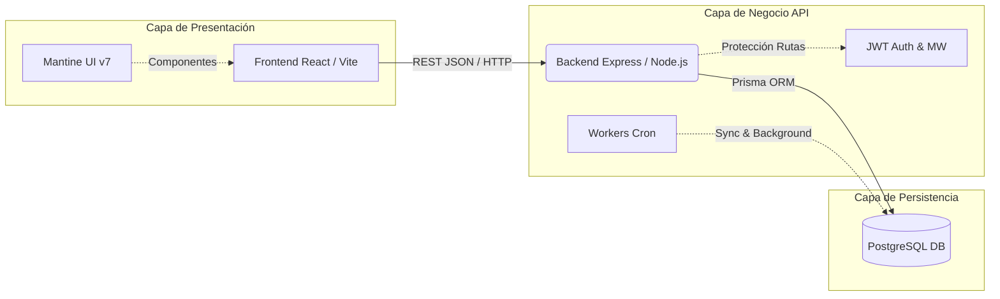
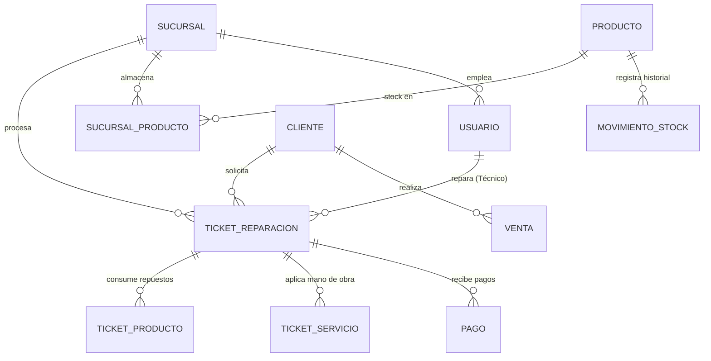

# RepairShop ERP — PRO MAX 🚀

Un moderno y robusto **Sistema de Planificación de Recursos Empresariales (ERP)** diseñado end-to-end específicamente para talleres de reparación de dispositivos electrónicos (celulares, tablets, laptops, consolas).

Este sistema facilita y unifica la gestión integral del negocio: desde la captura de clientes y el ingreso de tickets (con seguimiento visual Kanban), hasta el control multi-sucursal de inventarios, finanzas multimoneda y el cálculo de comisiones escalonadas para el personal técnico.


---

## 📐 Arquitectura del Sistema

El proyecto sigue una arquitectura Cliente-Servidor separada en dos directorios principales (`/frontend` y `/backend`), operando sobre una pila **PERN** (PostgreSQL, Express, React, Node) optimizada con Prisma ORM.



---

## 🗄️ Modelo de Datos (Core)

La base de datos relacional está altamente normalizada para permitir auditorías fiables en transacciones e inventario multi-sucursal.



---

## 📋 Características Principales

### 💻 Frontend (React + Vite + Mantine UI)
- **Dashboard Estadístico:** Vista ejecutiva de KPIs (Tickets activos, ingresos monetarios del día, alertas predictivas de bajo stock).
- **Tablero Kanban de Reparaciones:** Flujo de trabajo interactivo _drag-and-drop_ para rastrear el ciclo de vida del ticket (Recibido → Revisión → Esperando Repuesto → Reparado → Entregado).
- **Gestión Multi-Sucursal de Inventario:** Listado de stock en tiempo real diferenciado por sucursales, traspaso de mercancía y gestión de categorías (Repuestos, Accesorios).
- **Motor Financiero Multimoneda:** Soporte nativo para transacciones simultáneas en múltiples divisas (USD, MONEDA_LOCAL) con tasas de cambio flotantes, registro de ingresos/egresos y herramientas de cierre de caja.
- **Nómina y Comisiones:** Fórmulas dinámicas para técnicos basadas en porcentajes por servicio completado o salarios fijos.

### ⚙️ Backend (Node.js + Express + Prisma + PostgreSQL)
- **Domain-Driven Design (DDD):** Código rigurosamente estructurado por la lógica de los dominios de negocio (`finance`, `inventory`, `repairs`, `users`) garantizando su alta cohesión y escaso acoplamiento vertical.
- **Transacciones Seguras:** Implementación exhaustiva de hooks `.transaction()` de Prisma para asegurar principios ACID al realizar operaciones críticas (p. ej., descontar inventario *sólo si* la factura se genera).
- **Fotografías Financieras (Snapshots):** Los precios de catálogo y las comisiones en el momento de crear el ticket quedan "congeladas" en modelos intermedios, blindando los historiales contables ante alteraciones inflacionarias futuras.
- **Workers Auxiliares:** Tareas en segundo plano (Cron Jobs) que re-calculan o sincronizan información de gastos fijos concurrentes.

---

## 🛠️ Stack Tecnológico

| Entorno | Tecnologías Destacadas |
|---|---|
| **Frontend** | React 18, TypeScript, Vite, Mantine UI v7, React Query (TanStack), Tabler Icons, CSS Variables |
| **Backend** | Node.js (Express 5), TypeScript, Prisma ORM, JSON Web Tokens (JWT), Bcryptjs |
| **Database** | PostgreSQL |

---

## 🚀 Guía de Instalación Rápida

Para desplegar localmente el entorno de desarrollo:

### 1. Requisitos Previos mínimos
- [Node.js](https://nodejs.org/) (v18+)
- [PostgreSQL](https://www.postgresql.org/) (Corriendo en puerto `default: 5432` o acceso URI)
- Git

### 2. Clonar el repositorio e Iniciar

```bash
git clone <URL_DEL_REPOSITORIO>
cd ERP-Repair
```

### 3. Backend Setup

```bash
cd backend
npm install

# Generar y configurar Variables de Entorno (Agrega tu DATABASE_URL y JWT_SECRET al .env)
cp .env.example .env

# Sincronizar el Schema en la Base de Datos local
npx prisma generate
npx prisma db push

# Levantar el servidor en http://localhost:3001
npm run dev
```

### 4. Frontend Setup

```bash
cd frontend
npm install

# Levantar cliente web en http://localhost:5173
npm run dev
```

---

## 🤝 Flujo de Contribución

1. Haz un _Fork_ de este repositorio.
2. Crea una rama semántica partiendo desde `main` (`git checkout -b feature/NuevoModulo`).
3. Efectúa _Commit_ bajo convenciones convencionales (`git commit -m 'feat: Añade panel de envíos local'`).
4. _Push_ la rama a tu control de versiones (`git push origin feature/NuevoModulo`).
5. Abre y solicita un _Pull Request_.

## 📄 Licencia

Software amparado bajo la Licencia **MIT**. Consulta el documento interno de licencia para requerimientos de atribución.
